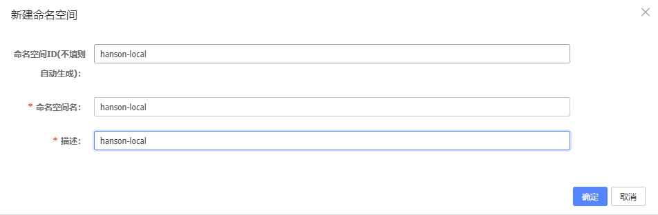
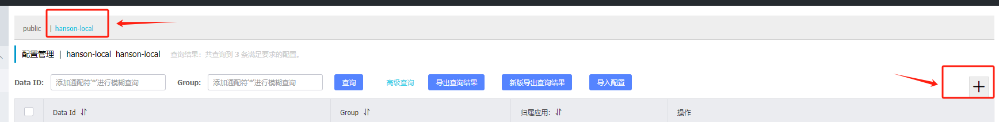
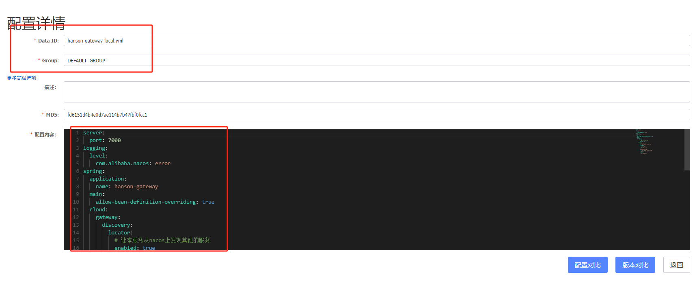
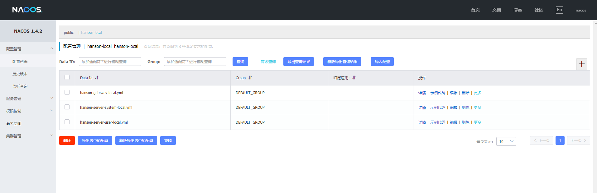

## 项目说明

本项目的使用 `Spring-cloud-alibaba` 搭建的，有使用到 nacos，如果你想要将该项目运行起来，则需要启动本地的 `nacos`。

创建命名空间：

启动本地 `nacos`，新增命名空间



新增命名空间成功之后可以在 `配置管理` 中的 `配置列表` 中看到，选中，然后添加配置：



新建配置：



各服务 nacos 的配置如下：



hanson-gateway 服务 -> nacos 上 `hanson-gateway-local.yml` 配置：

```yml
server:
  port: 7000
logging:
  level:
    com.alibaba.nacos: error
spring:
  application:
    name: hanson-gateway
  main:
    allow-bean-definition-overriding: true
  cloud:
    gateway:
      discovery:
        locator:
          # 让本服务从nacos上发现其他的服务
          enabled: true
      routes:
        # 网关路由配置
        - id: hanson_user
          uri: lb://hanson-server-user
          predicates:
            - Path=/user/**
          filters:
            - StripPrefix=1

        - id: hanson_system
          uri: lb://hanson-server-system
          predicates:
            - Path=/system/**
          filters:
            - StripPrefix=1  
```

hanson-system 服务 -> nacos 上 `hanson-server-system-local.yml` 配置：

```yml
server:
  port: 7001

spring:
  application:
    name: hanson-server-system
```

hanson-user 服务 -> nacos 上 `hanson-server-user-local.yml` 配置：

```yml
server:
  port: 7002

spring:
  application:
    name: hanson-server-user
```